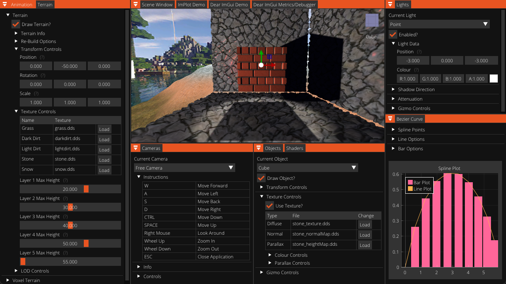

# Advanced Graphics

&nbsp;

&nbsp;

A graphics framework created using DirectX 11 that implements a range of advanced of graphics like complex texture mapping techniques and screen-space effects. 

## List of Features

  
<strong>Semester 1</strong>

  <ul>
    <li>Normal Mapping</li>
    <li>Parallax Mapping</li>
    <li>Occlusion Mapping</li>
    <li>Self-Shadowing</li>
    <li>Render-To-Texture</li>
    <li>Post-Processing</li>
    <li>Motion Blur</li>
    <li>FXAA</li>
    <li>SSAO</li>
    <li>Deferred Shading</li>
  </ul>

  
<strong>Semester 2</strong>

  <ul>
    <li>Shadow Mapping</li>
    <li>Terrain Generation</li>
    <li>Voxel Terrain Generation</li>
    <li>Model Animations</li>
    <li>Bezier Curve Splines</li>
  </ul>

## Dependencies

To use the framework, the following prerequisites must be met.
* Windows 10+
* Visual Studio
* Git Version Control

The framework relies on the following libraries and APIs to function.
* DirectX 11
* ImGui
* ImGuizmo
* ImGuiFileDialog
* M3d Loader
* Assimp
* rapidjson

### Installing

To download a copy of the framework, select "Download ZIP" from the main code repository page, or create a fork of the project. More information on forking a GitHub respository can be found [here](https://www.youtube.com/watch?v=XTolZqmZq6s).

### Executing program

As the project settings have been modified to support the addition of the aforementioned libraries and APIs, there are no additional steps required to execute the application.

## Appendices

 &nbsp;

---

### Credits

    Code Reference
        Luna, F., (2011). <em>Introduction to 3D Game Programming with DirectX 11,</em> Mercury Learning & Information.
        Available at: https://files.xray-engine.org/boox/3d_game_programming_with_DirectX11.pdf
    
        "Mathematics for 3D Game Programmming and Computer Graphics" by Eric Lengyel
    
    Model Animations
        https://github.com/jjuiddong/Introduction-to-3D-Game-Programming-With-DirectX11/blob/master/Chapter%2025%20Character%20Animation/SkinnedMesh/LoadM3d.h
    
    Perlin Noise
        https://github.com/OneLoneCoder/videos/blob/master/OneLoneCoder_PerlinNoise.cpp
    
    Shadow Mapping
        https://www.youtube.com/watch?v=CIGNP71FiG0
        https://www.youtube.com/watch?v=EPHjOUQ4rC8&list=PLqCJpWy5Fohd3S7ICFXwUomYW0Wv67pDD&index=64
        https://www.youtube.com/watch?v=tRsJ-b2ngIQ&list=PLqCJpWy5Fohd3S7ICFXwUomYW0Wv67pDD&index=65
